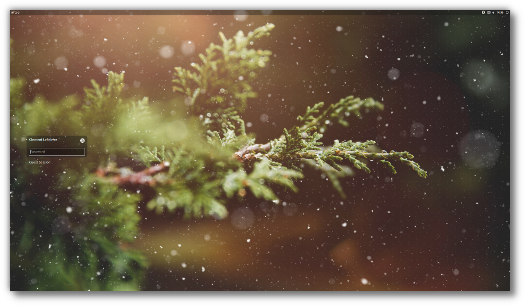
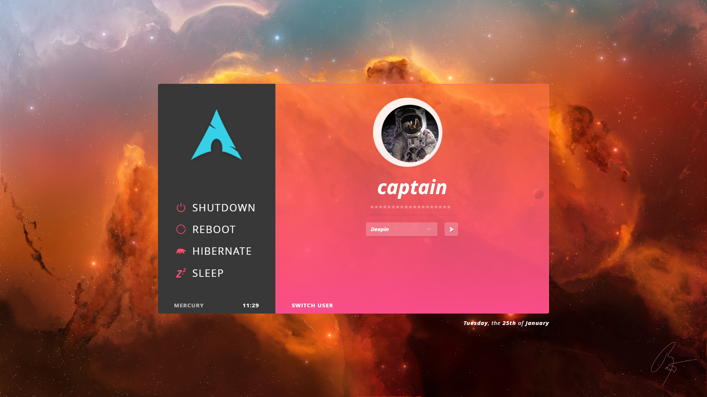

# 😊MY-I3WM-ARCH发🌗
>   主旨：简单，可控。发🤞🐱‍🏍

> 壁纸来源自 `ENDEAVOUR OS ` 官方推特👓

> `i3status-rust` **需要自行配置**🆗

## 👀I3WM 配置

### 😎软件

- dunst     # 通知
- alacritty # 终端
- lightdm  # 登录显示
- i3gaps   # i3wm 升级版
- i3status/i3status-rust(https://github.com/greshake/i3status-rust)  # i3bar 状态栏信息显示
- i3lock-fancy # 锁屏支持透明模糊背景
- i3block
- lxappearance	# 主题设置
- pcmanfm		# 文件管理工具
- nitrogen 		# 壁纸管理
- compton/picom  # 窗口合成器（特效）
- xarchiver # 解压缩
- stacer   # 系统管理工具
- ttf-hack # 编程字体
- wqy-microhei # 中文字体
- ibus&ibus-rime # 输入法
- networkmanager(nmtul) # 网络管理
- zsh&oh-my-zsh	
- vim
- paru  #rust开发的aur助手
- xorg

### 🤳配置

- ✔`alacritty` `dunst` `i3` `i3status`几个文件拷贝到`~/.config` 里

- ✔`.xprofile` `.zshrc`拷贝到用户目录`$HOME`里

### lightdm 主题

- 【**slick-greeter**】

下载链接：https://github.com/linuxmint/slick-greeter

- 【**Aether**】

下载链接 ：https://github.com/NoiSek/Aether

> 更多配置信息查看 **arch wiki**💕